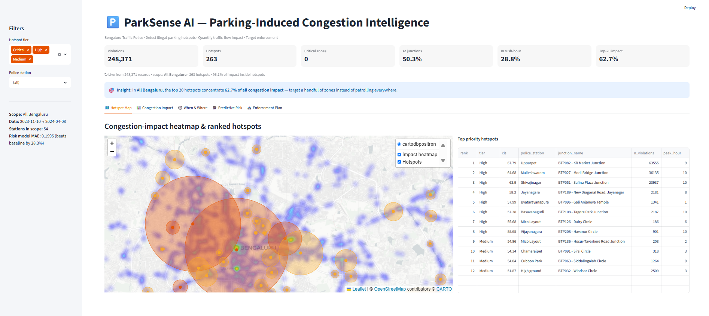
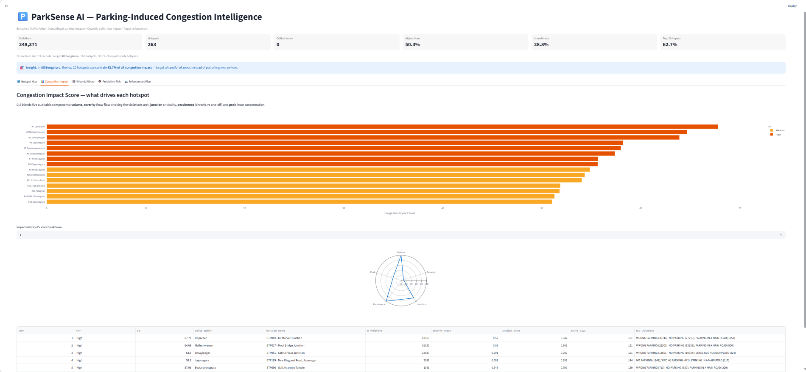
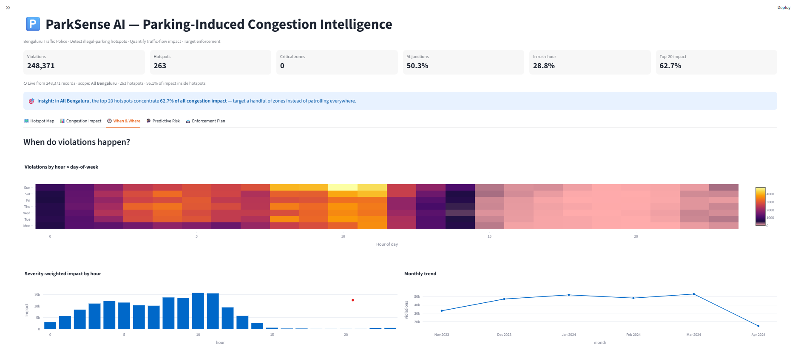
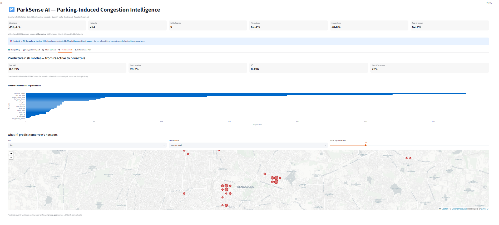
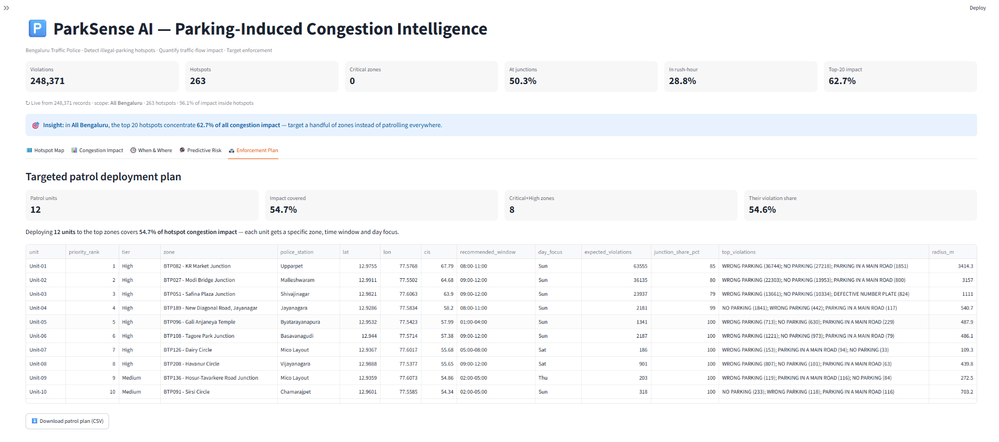
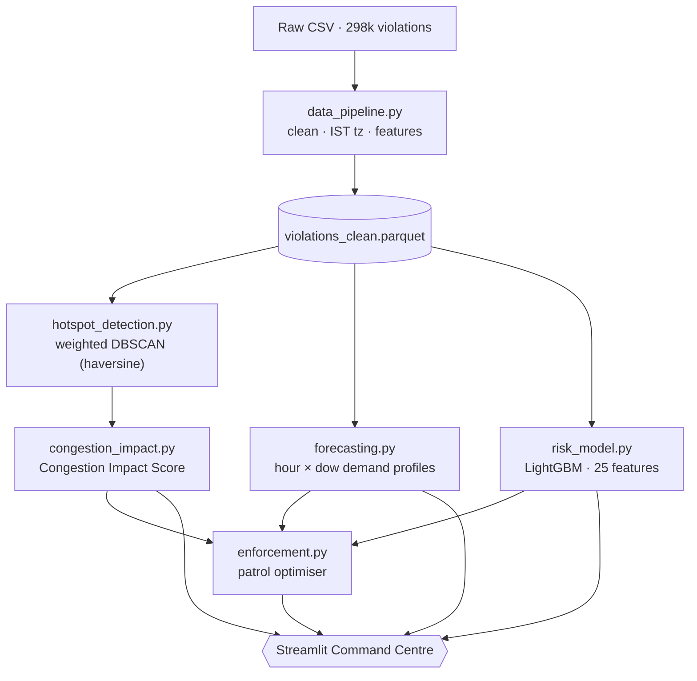
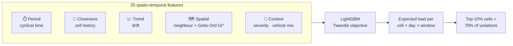
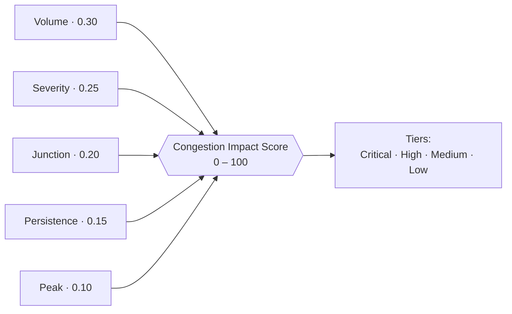

<!--
  ParkSense AI - GitHub README.
  HOW TO USE: when publishing to GitHub, move THIS file to the repository ROOT
  (replace the existing README.md). Keep the screenshots inside the `img/`
  folder so the image links below resolve correctly.
-->

<div align="center">

# 🅿️ ParkSense AI
### AI-Driven Parking Intelligence for Parking-Induced Congestion
**Bengaluru Traffic Police · Flipkart GRiD**


*Detect illegal-parking hotspots · Quantify their impact on traffic flow · Target enforcement*



</div>

---

## 🚦 The Problem

> On-street **illegal & spillover parking** near commercial areas, metro stations
> and events chokes carriageways and intersections. Today enforcement is
> **patrol-based and reactive**, there is **no heatmap of violations vs.
> congestion impact**, and it is **hard to prioritise enforcement zones**.

**ParkSense AI** turns **298,450 anonymised parking-violation records** into an
AI decision system that detects hotspots, **quantifies their traffic-flow
impact**, **predicts** where they will recur, and outputs a **deployable patrol
plan**.

---

## 🎯 Key Results

<div align="center">

| Metric | Value | Meaning |
|:--|:--:|:--|
| 🎯 **Congestion concentration** | **62.7%** | Top 20 of 263 hotspots hold 62.7% of citywide impact |
| 🔮 **Risk-model R²** | **0.496** | Explains ~50% of variance in expected parking load |
| 📈 **Beats baseline (MAE)** | **+28.3%** | 0.200 vs 0.278 — better than "use the cell average" |
| 🚓 **Operational capture** | **70%** | Patrol the top-10% predicted cells → catch 70% of violations |
| 🗺️ **Hotspot coverage** | **96.1%** | Share of all impact that sits inside detected hotspots |

*Validated on a **time-based hold-out** — trained on the first 80% of dates,
scored on the last 20% it never saw.*

</div>

---

## 🧠 What Makes It Different

| A typical submission | 🅿️ ParkSense AI |
|:--|:--|
| Heatmap of violation **counts** | **Congestion Impact** heatmap (flow-weighted) |
| Descriptive — *what happened* | **Predictive** — *what will happen* |
| "Here are the hotspots" | "Send **Unit-03 to KR Market, 18:00–21:00**" |
| Black-box accuracy claim | Future-validated, auditable, **+28.3%** over baseline |

---

## 🖼️ Dashboard Walkthrough

### 1 · Command Centre & Congestion-Impact Heatmap
Live KPIs, a severity-weighted heatmap, and the ranked hotspot table. The
sidebar filters **re-scope every metric in real time** (city → any police station).

<div align="center"></div>

### 2 · Congestion Impact Score
The CIS leaderboard plus a per-hotspot **radar breakdown** of the five score
components — fully auditable for enforcement officers.

<div align="center"></div>

### 3 · When & Where (Temporal Intelligence)
Hour × day-of-week heatmap, monthly trend and the offending **vehicle / violation
mix** — answering *when* to deploy patrols.

<div align="center"></div>

### 4 · Predictive Risk Model
Accuracy metrics, feature importance and a **what-if predictor** of tomorrow's
hotspots for any day + time-window.

<div align="center"></div>

### 5 · Enforcement Plan
A deployable patrol schedule — each unit gets a **zone, time window and day**,
with a one-click CSV export.

<div align="center"></div>

---

## 🏗️ Architecture



---

## 🔮 The Predictive Risk Model

We predict the **expected severity-weighted parking load** of every ~278 m cell
for each *(day-of-week × time-window)* — a stable, recurring demand surface a
planner can actually act on.



The feature design follows **ST-ResNet**'s *closeness + period + trend + external*
decomposition, plus **spatial-autocorrelation** (neighbour / Getis-Ord Gi\*)
features — see [Research Foundation](#-research-foundation).

---

## 📐 Congestion Impact Score (the core idea)

Instead of counting tickets, each violation is weighted by **how much it chokes
traffic flow**, then blended into one auditable 0–100 score per hotspot.



```text
CIS = 100 × ( 0.30·Volume + 0.25·Severity + 0.20·Junction
            + 0.15·Persistence + 0.10·Peak )
```

`Severity` is a domain weight per violation type, e.g.
`PARKING NEAR TRAFFIC LIGHT/ZEBRA = 1.0`, `PARKING IN A MAIN ROAD = 0.95`,
`DOUBLE PARKING = 0.90` … `PARKING ON FOOTPATH = 0.40`.

---

## 📚 Research Foundation

| Technique | Source | Why we used it |
|:--|:--|:--|
| **Spatio-temporal decomposition** (closeness + period + trend + external) | ST-ResNet — Zhang, Zheng & Qi, *AAAI 2017* (arXiv:1610.00081) | Blueprint for the feature groups |
| **Spatial autocorrelation** (Getis-Ord Gi\*, Moran's I) | Getis & Ord 1992; Anselin 1995; **Tobler's First Law** 1970 | Neighbour / spatial-lag features |
| **Density-based clustering (DBSCAN)** | Ester, Kriegel, Sander & Xu, *KDD 1996* | Organic hotspots, no preset count |
| **Gradient boosting + Tweedie loss** | LightGBM — Ke et al., *NeurIPS 2017* | Zero-inflated, non-negative load target |

---

## ⚙️ Tech Stack

`Python 3` · `pandas` / `numpy` · `scikit-learn` (DBSCAN) · `LightGBM` ·
`SciPy` · `Folium` + `streamlit-folium` · `Plotly` / `matplotlib` ·
`Streamlit` · `pyarrow`

**Engineering highlights:** live KPIs recomputed from data each render ·
`st.fragment` + `returned_objects=[]` so map zoom never reruns the app ·
`ThreadPoolExecutor` parallel artefact loading · cached loaders · one-command launcher.

---

## 🚀 Quickstart

```bash
pip install -r requirements.txt

# one command: build artefacts if missing, then open the dashboard
python run.py
```

<details>
<summary>Run stages explicitly</summary>

```bash
python run.py build       # (re)build data, hotspots, CIS, model, plan, maps
python run.py dashboard   # launch the Streamlit command centre
# or:  python src/build_all.py  &&  streamlit run app/dashboard.py
```
</details>

---

## 🗂️ Project Structure

```
ParkSense-AI/
├─ run.py                     # one-command launcher (build + dashboard)
├─ src/
│  ├─ config.py               # paths, congestion weights, CIS weights, grids
│  ├─ data_pipeline.py        # clean · IST tz · parse violations · features
│  ├─ hotspot_detection.py    # weighted DBSCAN (haversine)
│  ├─ congestion_impact.py    # Congestion Impact Score + tiers
│  ├─ forecasting.py          # hour×dow demand profiles · patrol windows
│  ├─ risk_model.py           # LightGBM spatio-temporal risk (25 features)
│  ├─ enforcement.py          # rank + optimise patrol allocation
│  ├─ visualize.py            # Folium maps + figures
│  └─ build_all.py            # runs the whole pipeline
├─ app/dashboard.py           # Streamlit command centre (5 tabs)
├─ .streamlit/config.toml     # theme + server settings
├─ img/                       # dashboard screenshots (this README)
├─ outputs/                   # generated artefacts (data, model, maps, kpis)
├─ requirements.txt
└─ README.md
```

---

## 🔐 Data & Ethics

Data: `jan to may police violation_anonymized*.csv` — **anonymised** records,
Bengaluru (Nov 2023 – Apr 2024). Only anonymised IDs are used — **no PII**. The
model targets *places and times*, not people or vehicles.

<div align="center">

**Built to turn reactive patrols into targeted, data-driven enforcement.** 🚦

</div>
